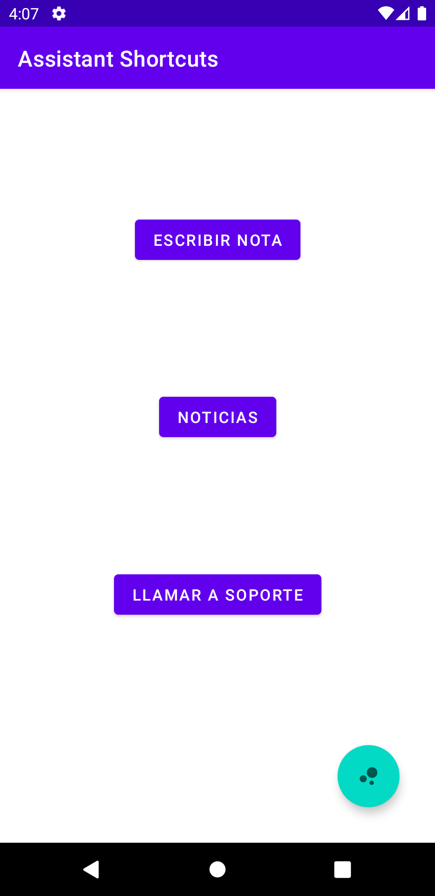
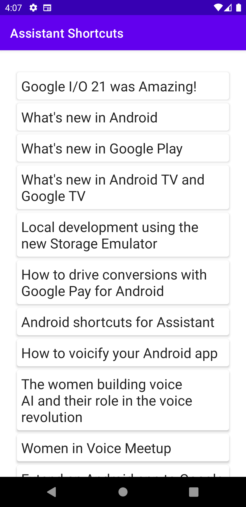
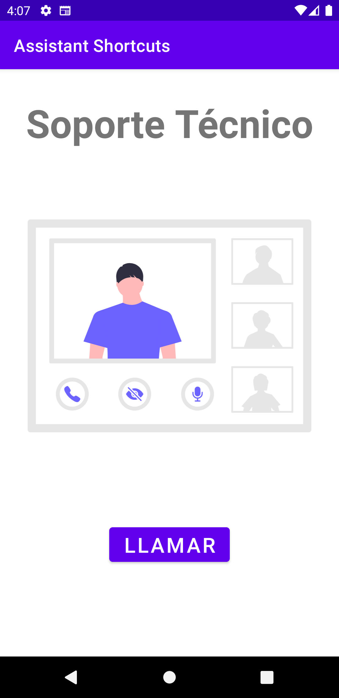
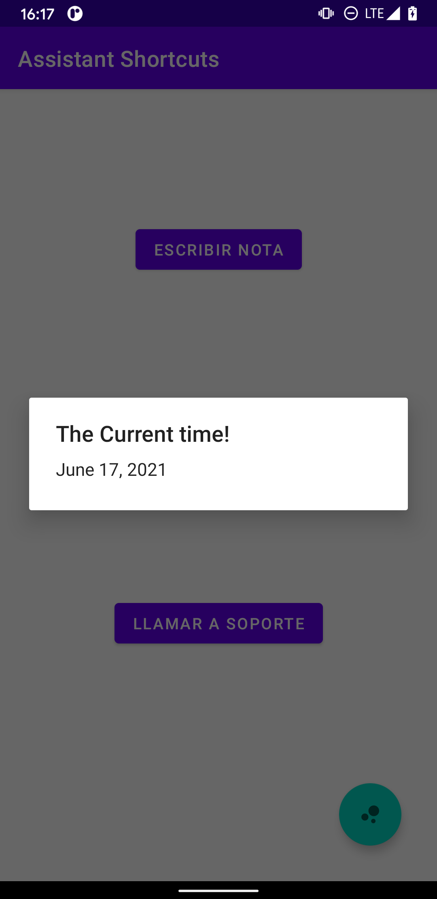
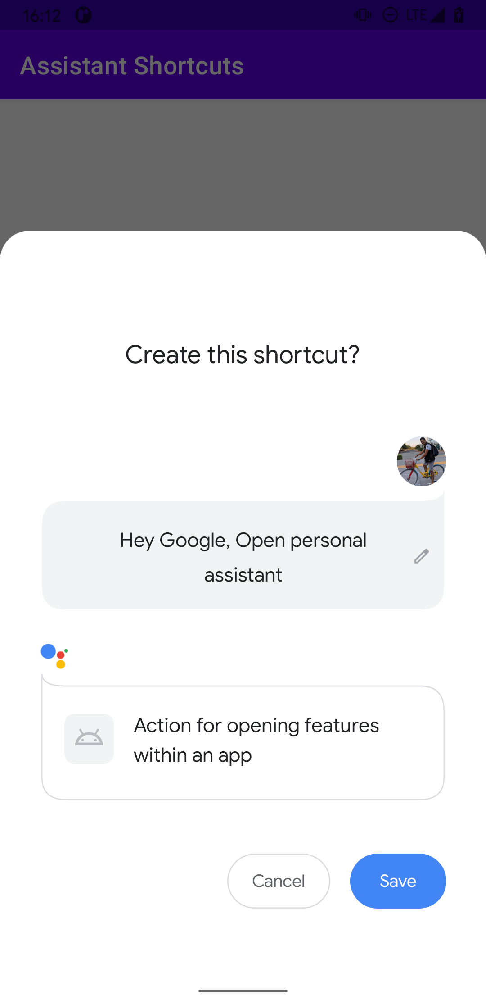
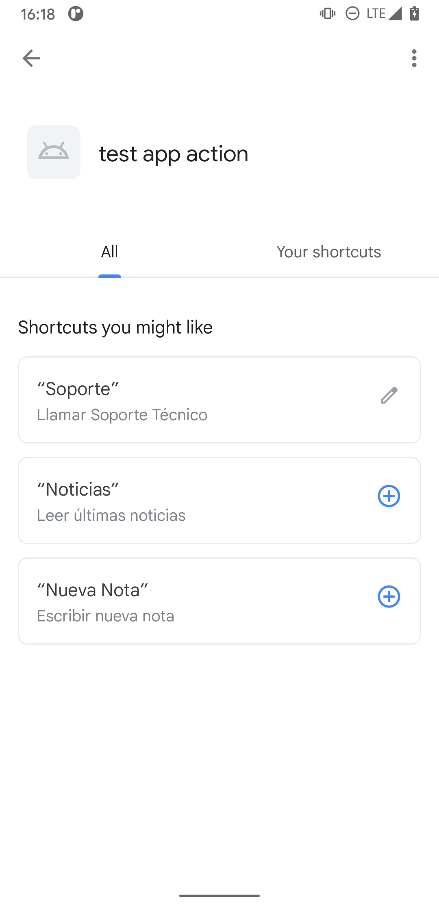

# Assistant Shortcuts (App Actions)

En este ejemplo, revisaremos el uso de los clásicos **Shortcuts** de Android repotenciados con **Google Assistant**, haciendo uso de los nuevos **Capabilities API** anunciados en el último Google I/O.

El proyecto está separado en ramas progresivas, de tal forma que puedes ir revisando las diferencias entre ellas cuando aprendas un nuevo concepto.

El orden sería:

 1. [main](https://github.com/Tohure/AssistantShortcuts) : Rama base con un proyecto simple de 3 pantallas (Fragments) unidas con Jetpack Navigation.
	> Jetpack Navigation: https://developer.android.com/guide/navigation
 
 2. [ShortcutClassic](https://github.com/Tohure/AssistantShortcuts/tree/ShortcutClassic) : Rama donde implementamos **Shortcuts**, la tecnología de Android que permite "Accesos Directos" desde el launcher (desktop) de nuestro teléfono manteniendo presionado los iconos y desplegándolos.

	> Shortcuts: https://developer.android.com/guide/topics/ui/shortcuts
  
  3. [ShortcutCapabilities](https://github.com/Tohure/AssistantShortcuts/tree/ShortcutCapabilities) : Rama donde se integran los clásicos **Shortcuts** de Android y las acciones de voz **App Actions** con el nuevo **Capabilities API** anunciados en el reciente *Google I/O 21*. 
  
	  > Capabilities: https://developer.android.com/guide/topics/ui/shortcuts/adding-capabilities
	  > App Actions: https://developers.google.com/assistant/app/overview

4. [CapabilitiesInAppPromo](https://github.com/Tohure/AssistantShortcuts/tree/CapabilitiesInAppPromo) : Rama donde usaremos **In-App Promo SDK** para hacer sugerencias directamente en la aplicación del uso o llamado de un flujo específico con Google Assistant.

	> In-App Promo SDK : https://developers.google.com/assistant/app/in-app-promo-sdk

5. [WidgetCapabilities](https://github.com/Tohure/AssistantShortcuts/tree/WidgetCapabilities) : Rama donde haremos uso de **Capabilities API** para invocar Widgets de Android, directamente en nuestro Google Assistant.

## Requerimientos
  
- Android Studio 4.2.*
- Android SDK 25 >
- Kotlin 1.4.* >
- Google Assistant Plugin for Android Studio ([LINK](https://plugins.jetbrains.com/plugin/16739-google-assistant))
- Cuenta Google Play Developers (Sólo para lanzar un Internal Testing y Android pueda asociar el ID de la aplicación con el Google Assistant de tu *teléfono||emulador*.
- Loguearse con la misma cuenta Gmail de la consola de Google Play Developers, en el *teléfono||emulador* y en  Android Studio para que el plugin de Google Assistant funcione correctamente.

## Disclaimer

 - El proyecto esta pensando para trabajar desde Android 7.1 (Nougat | Api 25) debido a que los **Shortcuts** son una tecnología que recién aparecieron en esta versión de Android y los nuevos **Capabilities API** trabajan con **Shortcuts**, sin embargo lo puedes instalar en dispositivos con Android 5 (Lollipop | Api 21) teniendo en cuenta que ni los Shortcuts ni los capabilities van a funcionar.
 - Para poder probar sea en un dispositivo o emulador, recuerda usar una misma cuenta de Gmail, tanto en Google Play Developers, en Android Studio y en tu teléfono.

## Colaboración

- Si tienes dudas o mejoras para el proyecto, no lo pienses y mándame un PR para poder revisarlo juntos.
- ¿Preguntas acerca de una parte en específico?, me puedes encontrar en Twitter y mándame un DM a: [@Tohure_](https://twitter.com/Tohure_)

## Screenshots
  
> 
___
> 
___
> 
___
> 
___
> 
___
> 